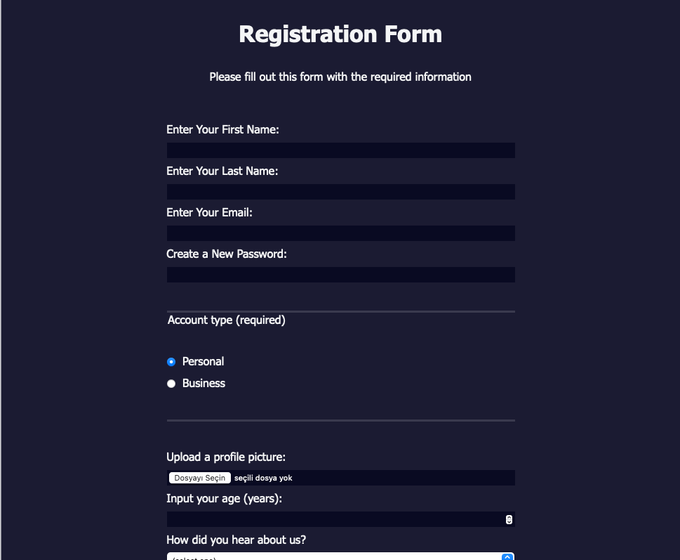

# Registration Form Project

This project is a user registration form designed using HTML and CSS. The form collects essential information from users and provides a clean, user-friendly interface.

## Features

- **Responsive Design**: The form adjusts to various screen sizes, ensuring usability on both desktop and mobile devices.
- **User Input Validation**: Ensures that all required fields are filled out and that user input meets specified criteria.
- **File Upload**: Allows users to upload a profile picture.
- **Form Submission**: Data is submitted to a specified URL for further processing.
- **Styled Interface**: A visually appealing design with clear instructions and intuitive layout.

## Technologies Used

- HTML5
- CSS3

## Form Fields

1. **First Name**: A required text input for the user's first name.
2. **Last Name**: A required text input for the user's last name.
3. **Email**: A required email input for the user's email address.
4. **Password**: A required password input with a pattern requirement (8 characters, lowercase letters and digits only).
5. **Account Type**: A required radio button input to select between personal and business accounts.
6. **Profile Picture**: An optional file input for uploading a profile picture.
7. **Age**: An optional number input for the user's age (between 13 and 120).
8. **Referrer**: An optional dropdown to select how the user heard about the service.
9. **Bio**: An optional textarea for the user to provide a short bio.
10. **Terms and Conditions**: A required checkbox to agree to the terms and conditions.

## Setup

1. **Clone the repository**:

    ```bash
    git clone <repository-url>
    ```

2. **Navigate to the project directory**:

    ```bash
    cd registration-form
    ```

3. **Open `index.html` in your browser** to view the form.

## Usage

Fill out the form with the required information and submit. Ensure all required fields are filled correctly to proceed with submission.

## Screenshot



## License

This project is licensed under the MIT License. See the [LICENSE](LICENSE) file for details.

## Contributing

Contributions are welcome! Please fork the repository and submit a pull request for any improvements or bug fixes.

## Acknowledgements

- [freeCodeCamp](https://www.freecodecamp.org) for providing the inspiration and resources for this project.

## Contact

For any questions or feedback, please contact [ozkanceyhan3419@gmail.com](mailto:your-email@example.com).
